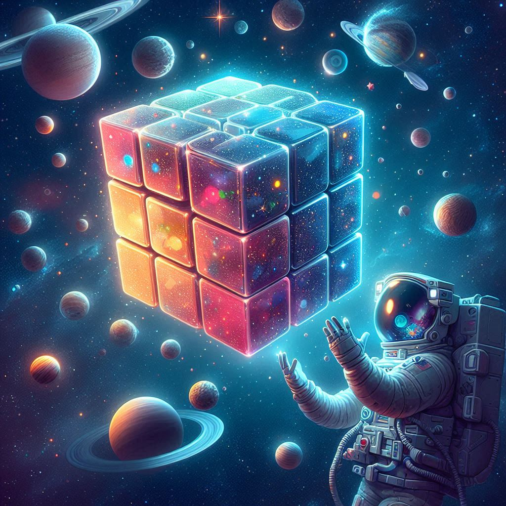

<div align="center">
    
</div>

# DiagonalMagicCubeSolver
Tugas Besar 1 IF3170 Inteligensi Artifisial  Pencarian Solusi Diagonal Magic Cube dengan Local Search


## Project Description
This project focuses on solving the Diagonal Magic Cube problem using local search methods. A Diagonal Magic Cube is a 3-dimensional extension of a magic square, where the sums of numbers on each row, column, pillar, and diagonal should be equal. This solver utilizes local search algorithms, such as Hill Climb, Simulated Annealing, and Genetic Algorithms, to find a solution that satisfies these constraints, exploring ways to optimize the cube configuration for achieving the magic constant on all necessary axes and diagonals.

### Tech Stack
1. Web Frameworks & Servers: Express
2. JavaScript Graphics Lib: Chart.js, Three.js
3. Programming Languages: Javascript


### Requirement
1. Web Browser 
2. Docker

### Using Docker
1. Run the Docker Desktop Application
2. Give the command at the root of this project
    ```
    docker-compose build
    ```
3. Give the command 
    ```
    docker-compose up
    ```
4. Access it in the browser using localhost with port 3000

## Screenshot
| Page                   | Screenshot              |
|--------------------------|----------------------------|
| Home Page |  |
| Solver Page |  |
| Solver Page |  |
| Solver Page |  |

## Task Allocation 

| NIM       | Responsible                                       |
|-----------|-----------------------------------------------|
| 13522129  | 3D Cube, Steepest, Stochastic, Laporan       |
| 13522136  | Random Restart, Sideways, Laporan             |
| 13522151  | Simulated Annealing, Laporan                  |
| 13522152  | Genetic Algorithm, Laporan                     |

